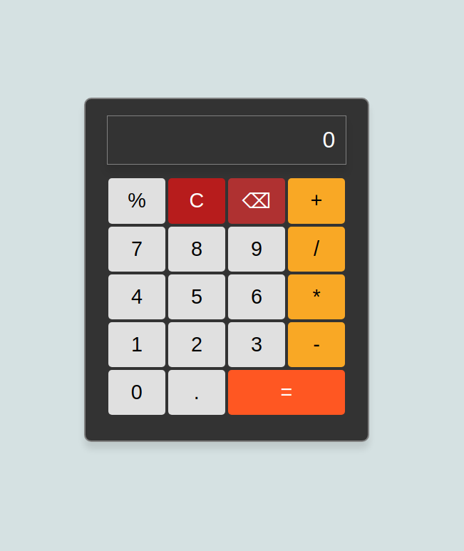

# Calculator

This is a calculator project from The Odin Project.

Below is a screenshot of the calculator interface.

## Features

- Basic arithmetic operations: addition, subtraction, multiplication and division.
- Percentage calculation and backspace functionality.

